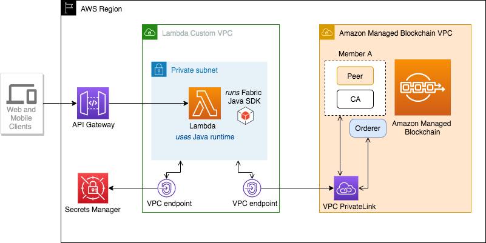

# Building a blockchain application in Java using Amazon Managed Blockchain

This project walks you through creating a blockchain application in Java running on AWS Lambda that interacts with your Amazon Managed Blockchain network using the Hyperledger Fabric Java SDK.
## Prerequisites

* AWS account with permissions to the following services: 
  * Amazon VPC, Amazon VPC endpoints, Amazon S3, AWS Secrets Manager, AWS Lambda, Amazon API Gateway
* [AWS CLI](https://aws.amazon.com/cli/)
* [AWS Serverless Application Model (AWS SAM) CLI](https://docs.aws.amazon.com/serverless-application-model/latest/developerguide/serverless-sam-cli-install.html) to deploy the application
* Java 8
* [Gradle](https://gradle.org/) or [Maven](https://maven.apache.org/)
* A Managed Blockchain network that is up and running in one of the supported AWS regions.
* At least one chaincode that is **installed** and **instantiated** on your blockchain network.

If you don’t have a blockchain network in your AWS account, follow the steps in [Get Started Creating a Hyperledger Fabric Blockchain Network Using Amazon Managed Blockchain](https://docs.aws.amazon.com/managed-blockchain/latest/managementguide/managed-blockchain-get-started-tutorial.html) and complete it up to step 7 before continuing this tutorial. 

## Solution overview
The following diagram illustrates the architecture of the solution.



## Step 1 - Configure the project

Clone the project from GitHub

```bash
git clone https://github.com/aws-samples/lambda-java-blockchain.git
cd lambda-java-blockchain
```

#### Dependencies
The two main dependencies used in the project are:

* [AWS Serverless Java container](https://github.com/awslabs/aws-serverless-java-container): this library makes it easy to run Java applications built with frameworks such as Spring, Spring Boot, Spark in AWS Lambda 
* Hyperledger Fabric Java SDK: library to read and write to the Fabric network running on Managed Blockchain.

Note: this project is built using the [Spring Boot 2 quick start example](https://github.com/awslabs/aws-serverless-java-container/wiki/Quick-start---Spring-Boot2) 

## Step 2 - Build and deploy the serverless stack using AWS SAM CLI

#### Copy TLS certificate to project's resrouces folder

Set the AWS region of your Managed Blockchain network and copy the TLS certificate chain `managedblockchain-tls-chain.pem` from S3 to the project's resources folder.

```bash
export REGION=us-east-1
aws s3 cp s3://${REGION}.managedblockchain/etc/managedblockchain-tls-chain.pem  src/main/resources/managedblockchain-tls-chain.pem
```

Build the application using AWS SAM CLI:

```bash
sam build
```

#### Setup environment variables
The Lambda function is configured to interact with the chaincode on behalf of a new Fabric user named `lambdaUser`. 
You will need your Fabric CA admin credentials to register and enroll a new Fabric identity for `lambdaUser`.

Set Fabric CA Admin username and password you used to create the blockchain network, and a choose a new password for `lambdaUser`.

```bash
export ADMINUSER='YOUR_CA_ADMIN_USER'
export ADMINPWD='YOUR_CA_ADMIN_PASSWORD'
export LAMBDAUSERPWD='LamdaUserPwd1'
```

#### Deployment
First, set the name of your blockchain network created in the prerequisites section.

```bash
export NETWORKNAME='YOUR_NETWORK_NAME'
```

Next, run the script `deployLambda.sh` to deploy the stack. 

```bash
./deployLambda.sh
```

The script starts by exporting all the required connection information for Managed Blockchain (such as NETWORKID, MEMBERID, PEERID, PEERENDPOINT etc.).

```bash
_______________________________________
1. Exporting environment variables
_______________________________________
export REGION=us-east-1
export NETWORKID=n-XXXXXXXXXX

...

export PEERENDPOINT=nd-xxx.m-xxx.n-xxx.managedblockchain.us-east-1.amazonaws.com:30003
export AMBVpcEndpointServiceName=com.amazonaws.us-east-1.managedblockchain.n-xxx
```

It then creates an S3 bucket to host the Lambda source code and runs `sam deploy` to deploy the stack.

```bash
_______________________________________
2. Deploying the stack with 'sam deploy'
_______________________________________
Creating s3 bucket to host Lambda sources: lambda-java-blockchain-sam-bucket-xxxxxxxxxx
make_bucket: lambda-java-blockchain-sam-bucket-xxxxxxxxxx

	Deploying with following values
	===============================
	Stack name                 : lambda-java-blockchain
	Region                     : us-east-1
	Confirm changeset          : False
	Deployment s3 bucket       : lambda-java-blockchain-sam-bucket-xxxxxxxxxx
	Capabilities               : ["CAPABILITY_IAM"]
	Parameter overrides        : {'AMBREGION': 'us-east-1', ... 'AMBVpcEndpointServiceName': 'com.amazonaws.us-east-1.managedblockchain.n-xxx'}
```

After a successful deployment you will see an output similar to this:

```bash
CloudFormation outputs from deployed stack
---------------------------------------------------------------------------------------------------------------------------------------------------------
Outputs
---------------------------------------------------------------------------------------------------------------------------------------------------------
Key                 BlockchainLambdaApi
Description         URL for Managed Blockchain Lambda Function
Value               https://XXXXXX.execute-api.us-east-1.amazonaws.com/
---------------------------------------------------------------------------------------------------------------------------------------------------------

Successfully created/updated stack - lambda-java-blockchain in us-east-1
Lambda source code is stored in the S3 bucket - lambda-java-blockchain-sam-bucket-xxxxxxxxxx
```

Your stack has been successfully deployed and an API has been deployed on API-Gateway, which is accessible at https://XXXXXX.execute-api.us-east-1.amazonaws.com/.
You can also retrieve the URL on the [AWS CloudFormation](https://console.aws.amazon.com/cloudformation/) console: find the stack named `lambda-java-blockchain` and choose the **Outputs** tab)

On this sample project, the URL of the API is publicly accessible for testing purposes. In your own application, you should protect your API; for example, by integrating with [Amazon Cognito](https://aws.amazon.com/cognito/) user pools. For more information about API access, see [Controlling and managing access to APIs in API Gateway](https://docs.aws.amazon.com/apigateway/latest/developerguide/apigateway-control-access-to-api.html).

## Step 3 - Register and enroll lambdaUser with the Fabric CA using the SDK
Call the `/enroll-lambda-user` endpoint on API-Gateway to start the enrollment process for `lambdaUser`.

```bash
export API_URL=$(aws cloudformation describe-stacks --stack-name lambda-java-blockchain --query "Stacks[0].Outputs[?OutputKey=='BlockchainLambdaApi'].OutputValue" --output text --region $REGION)
curl -s -X POST "${API_URL}/enroll-lambda-user"
```

response

```bash
lambdaUser registered and enrolled successfully
```

## Step 4 - Test the application and interact with Managed Blockchain
You are now ready to interact with the chaincode `mycc` created in Step 7 of [Get Started Creating a Hyperledger Fabric Blockchain Network Using Amazon Managed Blockchain](https://docs.aws.amazon.com/managed-blockchain/latest/managementguide/managed-blockchain-get-started-tutorial.html).

Let's query the balance of account a. Run curl command on your API URL and send a `GET /query` request as follows:

```bash
$ curl -s -X GET "${API_URL}/query?chaincodeName=mycc&functionName=query&args=a"


90
```

Next, invoke the chaincode to transfer 10 from account a to b. Call the endpoint `POST /invoke` as follows:

```bash
$ curl -s -X POST "${API_URL}/invoke" -H "Content-Type: application/json" \
    -d '{"chaincodeName": "mycc", "functionName": "invoke", "argList": ["a", "b", "10"]}'

Invoke successful
```

Finally, query the balance of account a, it should be decreased by 10.

```bash
$ curl -s -X GET "${API_URL}/query?chaincodeName=mycc&functionName=query&args=a"

80
```

## (Optional) Step 5 - Querying other chaincodes

#### Fabcar chaincode examples
This section provides few examples of reading and writing to the `fabcar` chaincode from fabric-samples.

**Pre-requisites**

* Ensure that the `fabcar` chaincode is installed & instantiated on your peer node. 

* To install `fabcar`, log into your **Hyperledger Fabric client EC2 instance** and execute the following command:

  ```bash
  docker exec cli peer chaincode install -n fabcar -v v0 -p github.com/fabcar/go
  ```

* Instantiate `fabcar` from **Hyperledger Fabric client EC2 instance** with the following command:
  
  ```bash
  docker exec cli peer chaincode instantiate -o $ORDERER -C mychannel -n fabcar -v v0 \
    -c '{"Args":["initLedger"]}' \
    --cafile /opt/home/managedblockchain-tls-chain.pem --tls
  ```

The chaincode instantiation of fabcar will create 10 samples cars in the blockchain.

Use the pre-configured endpoint `GET /cars/{carId}` to query a car by id. Query for car with id `CAR1`.

```bash
$ curl -s -X GET "${API_URL}/cars/CAR1"

{"id":"CAR1","make":"Ford","model":"Mustang","colour":"red","owner":"Brad"}
```

To create a new car, send the request to `POST /cars`

```bash
$ curl -s -X POST "${API_URL}/cars" -H "Content-Type: application/json" \
    -d '{"id":"CAR20", "make":"Ford","model":"Mustang","colour":"Red","owner":"John"}'

Car created successfully
```

Finally, verify that you can retrieve the newly created car.

```bash
$ curl -s -X GET "${API_URL}/cars/CAR20"

{"id":"CAR20","make":"Ford","model":"Mustang","colour":"Red","owner":"John"}
```
  
## Cleaning Up
To delete the AWS resources created in this project, simply delete the serverless stack with the following command:

```bash
aws cloudformation delete-stack --stack-name lambda-java-blockchain
```

Also delete the S3 bucket which was created in step 2

```bash
aws s3 rb s3://lambda-java-blockchain-sam-bucket-xxxxxxxxxx --force
```

## Security

See [CONTRIBUTING](CONTRIBUTING.md#security-issue-notifications) for more information.

## License

This library is licensed under the MIT-0 License. See the LICENSE file.
